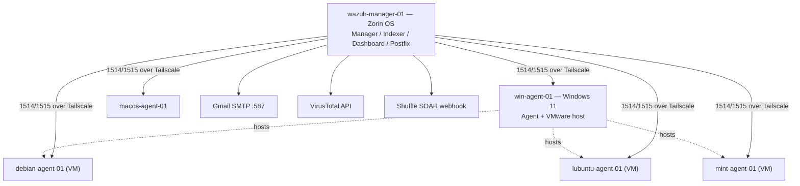

Overiew Of all results and findings


# Wazuh SIEM Home Lab: Multi-OS Deployment, Alerting Pipeline & Detection Validation

*Personal security-engineering project — deploying a centralized Wazuh SIEM across six heterogeneous endpoints, wiring an email alerting pipeline, and validating detections against a full day of live telemetry.*

> **A note on redaction:** hostnames, the manager's local username, the alert-recipient mailbox, and third-party API keys/webhook URLs have been anonymized or replaced with `[REDACTED]` throughout. All operational values below — intervals, thresholds, rule IDs, alert counts — are reproduced exactly as configured or observed.

## 1. Overview

This lab centralizes log collection, file integrity monitoring, configuration auditing, and vulnerability detection for a mixed fleet of physical and virtual endpoints spanning Linux, Windows, and macOS. All manager-agent traffic rides a private Tailscale mesh, so the SIEM's two listening ports (1514/1515) are never exposed to the public internet. The write-up below is built directly from the deployed `ossec.conf`, the custom rule file, the Postfix relay config, and a 774-alert capture spanning **2026-09-07 00:02:35 – 23:05:25**.

## 2. Architecture

| Node | Role | OS | Notes |
|---|---|---|---|
| `wazuh-manager-01` | Manager, indexer, dashboard, Postfix relay | Zorin OS (bare metal) | Single-node deployment; clustering is present in config but disabled |
| `win-agent-01` | Agent + VMware hypervisor | Windows 11 | Hosts the three Linux VMs below; primary FIM/SCA target |
| `macos-agent-01` | Agent | macOS (MacBook Air) | External laptop; network/session telemetry |
| `debian-agent-01` | Agent (VM) | Debian | Enrolled via APT; intended SSH brute-force target |
| `lubuntu-agent-01` | Agent (VM) | Lubuntu | Enrolled via APT |
| `mint-agent-01` | Agent (VM) | Linux Mint | Enrolled via APT |

All six nodes sit on a single Tailscale tailnet (100.x.x.x CGNAT range), which handles NAT traversal and encryption in transit so ports 1514 (agent data) and 1515 (enrollment) never need a public listener or a firewall exception.



## 3. Core SIEM Configuration

Pulled directly from the manager's `ossec.conf`:

| Module | Setting | Value |
|---|---|---|
| File Integrity Monitoring (`syscheck`) | Scan frequency | 12h (43200s), `scan_on_start=yes` |
| | Monitored paths | `/etc`, `/usr/bin`, `/usr/sbin`, `/bin`, `/sbin`, `/boot` + Windows registry |
| | Throughput cap | `max_eps=50`; DB sync every 5 min |
| Rootcheck | Frequency | 12h; checks files, trojans, dev, sys, pids, ports, network interfaces |
| Security Configuration Assessment (SCA) | Frequency | 12h, `scan_on_start=yes` |
| Vulnerability Detection | Feed refresh | Hourly (`60m`) |
| Agent transport | Port/protocol | 1514/tcp, `connection=secure` |
| Enrollment (`wazuh-authd`) | Port | 1515/tcp |
| Agent liveness | Disconnection threshold | 15 minutes of silence |
| Indexer/Dashboard | Deployment | Self-hosted, single-node (`127.0.0.1:9200`, TLS) |
| Clustering | Status | Present in config, `disabled=yes` |
| Ruleset | Exclusion | `0215-policy_rules.xml` excluded from default ruleset |

**Active Response** is deliberately staged, not fully wired: `firewall-drop`, `host-deny`, `disable-account`, `route-null`, and `netsh` are all registered as executable commands, but no `<active-response>` block yet binds any of them to a triggering rule or level. This means the mitigation scripts are installed and ready, but nothing on the manager will invoke them automatically yet — a sensible sequencing choice while the ruleset is still being tuned (see §7–8).

## 4. Third-Party Integrations


### VirusTotal
Configured against the `syscheck` group (any FIM event, level ≥3, JSON alert format). This is live and working: over the capture window it fired on both Linux file-hash lookups (e.g., a modified CUPS config file, returned "no records found") and Windows registry-value hash lookups (e.g., a VSS registry writer key). It also hit the **free-tier public API rate limit** mid-scan (`Error: Public API request rate limit reached`, rule 87101) — a direct signal that FIM-triggered lookup volume on the Windows host outpaces the 4 requests/minute free-tier ceiling, and a good candidate for throttling or a paid key before relying on this for real detections.

### Shuffle (SOAR)
Configured to forward alerts (level ≥3, JSON) to a self-hosted Shuffle webhook. The forwarding path is wired in `ossec.conf`, but no Shuffle-tagged events appear in this capture window — the integration hasn't been exercised yet.

## 5. Alerting Pipeline

- **Relay:** local Postfix instance relays outbound mail through `[smtp.gmail.com]:587` using SASL authentication (`smtp_sasl_auth_enable=yes`) and enforced TLS (`smtp_tls_security_level=encrypt`). `sender_canonical_maps` rewrites the local sender address so Gmail doesn't reject mail claiming to be from the bare hostname.
- **Relay scope:** `mynetworks = 127.0.0.0/8 [::1]/128` — only the manager itself can relay through this Postfix instance; it isn't an open relay. `inet_interfaces=all` does mean Postfix listens on every interface, though — tightening that to loopback-only would be a small defense-in-depth win since only local processes need it.
- **Threshold:** `email_alert_level` is set to **12** — only alerts at or above level 12 generate an email, independent of the lower `log_alert_level=3` used for the on-disk log.
- **Pipeline self-test:** a custom rule was authored specifically to validate this path:

  ```xml
  <group name="local,">
    <rule id="100002" level="12">
      <match>Email_probe</match>
      <description>Manually testing email alert</description>
    </rule>
  </group>
  ```

  Setting the test rule's level to exactly 12 was intentional — it's the minimum level that clears the configured email threshold, so a manual trigger proves the alert → email path end-to-end without waiting for a real event to happen to reach that severity.
- **Verification method:** delivery is checked by tailing `/var/log/mail.log` for the Postfix transaction and `ossec.log` for the `ossec-maild` handoff. *(The mail.log sample available at write-up time was empty, so no specific delivery timestamp is quoted here — re-run the rule-100002 trigger and capture `mail.log` fresh if you want a delivery-confirmation excerpt in a future revision.)*
- **Credentials:** the Gmail relay account authenticates via an app password stored in `/etc/postfix/sasl_passwd`. That file (along with the real VirusTotal key and Shuffle webhook URL in the working `ossec.conf`) contains live secrets — **rotate all three before publishing this config publicly**, since none of them belong in a portfolio repo even redacted-in-the-report.

## 6. Detection Validation — Live Capture, 2026-09-07

774 alerts across ~30 distinct rule IDs, all from `wazuh-manager-01` (self-monitoring), `win-agent-01`, and `macos-agent-01`. The Debian/Lubuntu/Mint VMs weren't emitting alerts during this particular window, so their intended detections (SSH brute-force, AppArmor/PAM) aren't represented below — see §8.


### Manager self-monitoring (Zorin OS)
- **AppArmor DENIED** (rule 52002, level 3) — `cups-browsed` denied the `sys_nice` capability. Routine confinement noise from CUPS printing, not attacker activity.
- **Rootcheck: "Possible kernel level rootkit"** (rule 521, level 11) — flagged hidden mount points named `/tmp/.mount_veracr*`. This is a well-documented **false positive**: VeraCrypt mount points are hidden from `readdir()` while still showing up in filesystem stats, which trips Wazuh's hidden-file heuristic. Correctly triaging this as benign (rather than chasing it as a live rootkit) is the actual point of the exercise.
- **FIM + VirusTotal cross-check** (rule 550, level 7 → rule 87103) — `/etc/cups/subscriptions.conf.O` was modified, and the integration automatically submitted its hash to VirusTotal, which returned "no records found." Shows the FIM → enrichment pipeline working end-to-end on a real file change.
- **Session/privilege tracking** (rules 5501/5502/5402, level 3) — PAM login/logout and `sudo`-to-root events, including the operator editing `ossec.conf` itself mid-project.
- **Log-volume anomaly** (rule 11, level 4) — one hour's log rate hit 4,859 events against a running average of 1,943, Wazuh's built-in flood/anomaly check firing correctly.

### Windows agent (`win-agent-01`)
- **Registry FIM noise** (rules 594/750/751/752, levels 5) — 345 alerts (**45% of the day's total**) across Defender Policy Manager, BITS, ACPI, `DsmSvc`, IE elevation policy, Windows Firewall dynamic rule entries, and `EventLog\Application\Edge` keys. All confirmed as routine OS/AV housekeeping — the single largest tuning opportunity in the deployment (see §7).
- **Service startup-type change, Event ID 7040** (rule 61104, level 3) — the Background Intelligent Transfer Service's start type changed from **Demand Start to Automatic Start**, correctly mapped to MITRE ATT&CK T1112 (Modify Registry).
- **CIS compliance scan** — `CIS Microsoft Windows 11 Enterprise Benchmark v3.0.0` completed with a summary alert (rule 19005, level 9):
  ```
  passed: 123, failed: 353, invalid: 6, total_checks: 482, score: 25.84%
  ```
  The individual check for "Enforce password history" (CIS check 26000) resolved to **failed** (rule 19014, level 9) — the policy is set to 0 rather than the recommended 24, confirmed directly from the SCA engine's own JSON payload.
- **Auth visibility** — successful interactive logon (rule 60118, event 4624) and its corresponding logoff (rule 67023, event 4634), giving a correlatable logon/logoff pair for baseline account activity.
- **Low-value noise** — Software Protection Platform scheduling, an NTP-driven system time change, a DCOM registration timeout, and a Windows Error Reporting summary all logged at level 3–5 with no security relevance.

### macOS agent (`macos-agent-01`)
- **Listening-port change detection** (rule 533, level 7) — the scheduled `netstat` command monitoring caught a change in open TCP/UDP ports, confirming the same `localfile` command logic works identically across the Linux, Windows, and macOS agents.
- **Agent connectivity tracking** (rule 504, level 3) — disconnect/reconnect events surfaced correctly via `wazuh-monitord`, validating the 15-minute liveness threshold is doing its job.

## 7. Findings & Operational Notes

- **Alert volume is dominated by two sources, not attacks.** FIM registry noise (rules 594/750/751/752) plus VirusTotal enrichment results (rules 87101/87103) together account for **647 of 774 alerts — roughly 84%** of everything the manager logged in a day. Before any correlation rule work happens, this is the noise floor that needs suppressing.
- **SCA baseline is weak but well-documented:** 25.8% compliance against CIS Windows 11 v3.0.0, with password history (set to 0 vs. the recommended 24) as one concretely-verified example of 353 failing checks.
- **One rootcheck alert needed triage, not remediation** — the VeraCrypt-mount "possible rootkit" hit is a known false positive and a good argument for a documented rootcheck exception rather than an ignore-and-forget.
- **VirusTotal's free tier is already a bottleneck** at this scan volume; either throttle FIM-triggered lookups or move to a paid key before depending on this for real coverage.
- **Active Response and Shuffle are both wired but unexercised** — commands/webhook are configured, but nothing has triggered them yet in this environment.
- **Minor hardening opportunity:** Postfix's `inet_interfaces=all` is broader than it needs to be given `mynetworks` already restricts relay to localhost; scoping to loopback would tighten the attack surface with no functional cost.

## 8. Roadmap

1. Bring the Debian, Lubuntu, and Mint VM agents online for a repeat capture window, and run the SSH brute-force simulation (targeting Debian) and AppArmor/PAM checks (Lubuntu/Mint) so those detections have real, evidenced alert data alongside the Windows/macOS/manager results above.
2. Suppress the highest-volume, lowest-value FIM registry keys (Defender heartbeat-style keys, ACPI, SPP, dynamic Firewall rule churn) in `local_rules.xml` to cut the ~45% registry-noise share before adding new correlation rules on top of it.
3. Add a documented rootcheck exception for the VeraCrypt mount-point false positive instead of re-triaging it every scan.


## Skills Demonstrated

SIEM deployment & administration · multi-OS agent enrollment (Linux/Windows/macOS, physical + virtualized) · FIM/SCA/vulnerability-detection configuration · custom Wazuh rule authoring and validation · alert triage (including correctly identifying a rootcheck false positive) · third-party API integration and troubleshooting (VirusTotal rate limiting) · secure mail relay configuration (Postfix/SASL/TLS) · MITRE ATT&CK mapping · zero-exposure network design (Tailscale mesh, no public listeners).
